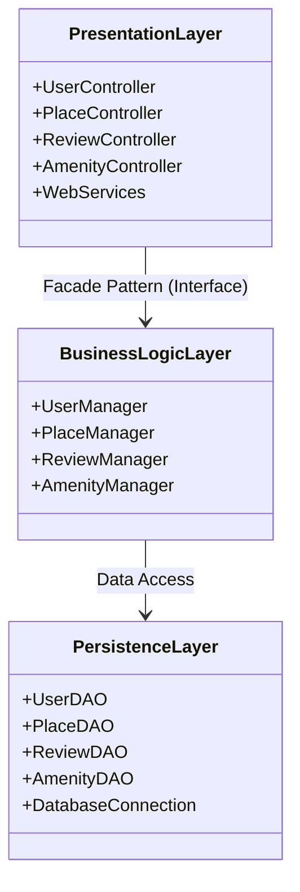
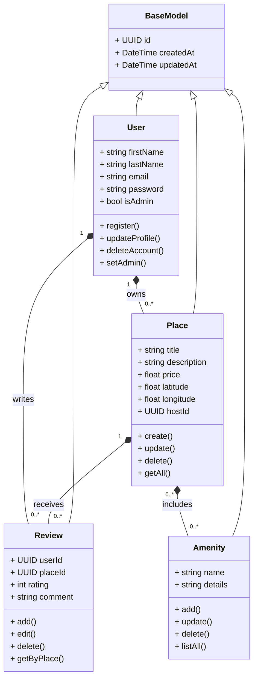
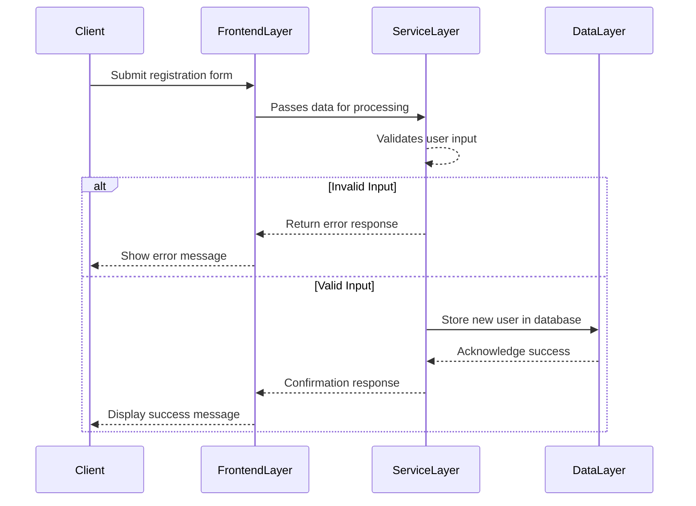
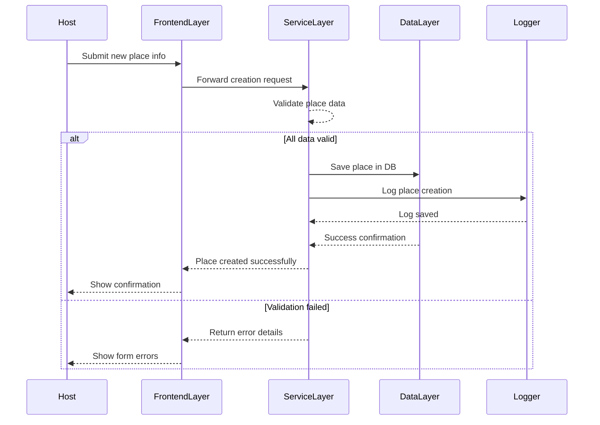
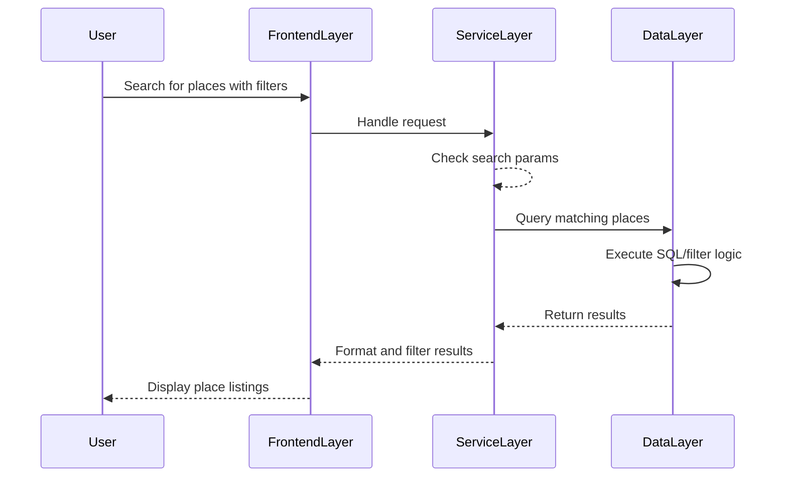
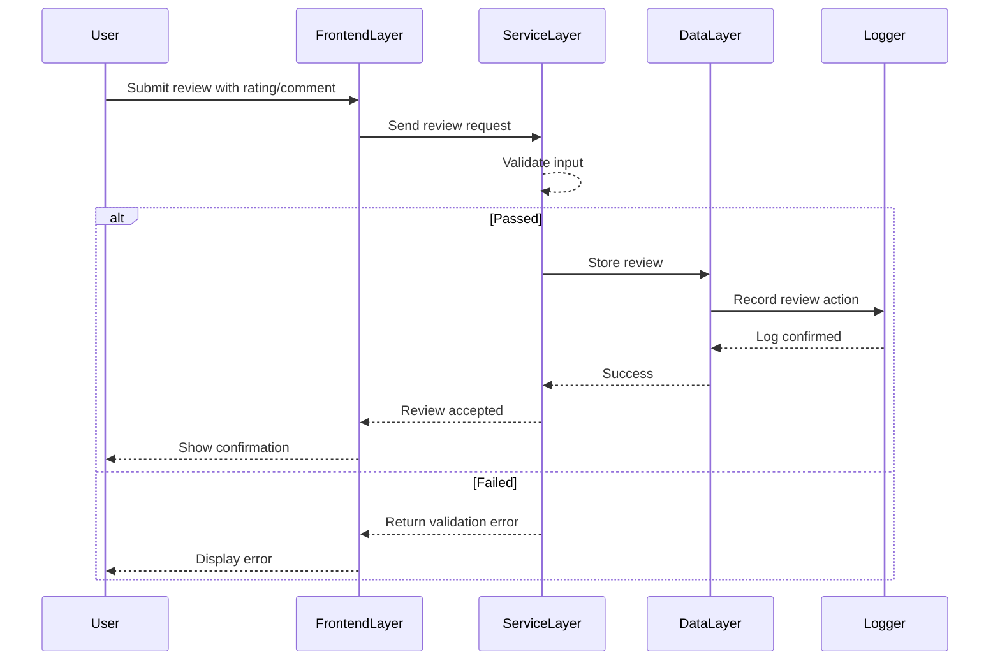

# HBnB Project – Technical Documentation

## Introduction

This document serves as the comprehensive technical blueprint for the HBnB project, a web-based rental booking platform inspired by Airbnb. It compiles all architectural diagrams and explanatory notes, providing a clear reference for the system’s design and guiding the implementation phases. The document covers the high-level architecture, business logic, and detailed API interaction flows.

---

## 1. High-Level Architecture

### Package Diagram

#### Explanatory Notes

- **Purpose:** This diagram illustrates the overall layered architecture of the HBnB system.
- **Key Components:**
  - **PresentationLayer:** Handles HTTP requests, user input, and API endpoints.
  - **BusinessLogicLayer:** Contains core business rules and logic, exposed via a facade.
  - **PersistenceLayer:** Manages data storage and retrieval, abstracting the database.
- **Design Decisions:**
  - **Layered Approach:** Promotes separation of concerns, maintainability, and testability.
  - **Facade Pattern:** The PresentationLayer interacts with the BusinessLogicLayer through a unified interface, simplifying API design and decoupling layers.
- **Role in Architecture:** This structure ensures that each layer has a clear responsibility, making the system modular and scalable.

---

## 2. Business Logic Layer

### Class Diagram

#### Explanatory Notes

- **Purpose:** Details the main entities and their relationships in the business logic layer.
- **Key Components:**
  - **BaseModel:** Provides common fields (`id`, `createdAt`, `updatedAt`) for all entities.
  - **User:** Represents platform users, including admin status and authentication methods.
  - **Place:** Represents rental listings, linked to an owner (User) and amenities.
  - **Review:** Represents user feedback on places, linked to both User and Place.
  - **Amenity:** Represents features available at a place.
- **Design Decisions:**
  - **Inheritance:** All entities inherit from `BaseModel` for consistency.
  - **Associations:** Relationships (e.g., User owns Places, Place has Reviews) are explicitly modeled for clarity and data integrity.
- **Role in Architecture:** This diagram guides the implementation of the core business logic and data models.

---

## 3. API Interaction Flow

### Sequence Diagrams

#### 3.1 User Registration

**Notes:**  
- Shows the flow from user registration request to database persistence.
- Validation is handled in the ServiceLayer; errors are returned immediately if input is invalid.

---

#### 3.2 Place Creation

**Notes:**  
- Demonstrates the process for creating a new place, including validation and logging.
- Ensures that only valid data is persisted and that actions are auditable.

---

#### 3.3 Place Listing (Search)

**Notes:**  
- Illustrates how search requests are processed, validated, and fulfilled.
- The ServiceLayer ensures only valid queries reach the DataLayer.

---

#### 3.4 Review Submission

**Notes:**  
- Captures the review creation process, including validation and audit logging.
- Ensures traceability and data integrity for user-generated content.

---

## Conclusion

This technical document provides a unified and detailed view of the HBnB project’s architecture, business logic, and API flows. The diagrams and explanations herein serve as a reference for developers and stakeholders, ensuring a shared understanding and a solid foundation for implementation and future enhancements.
