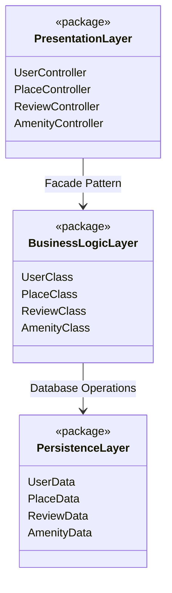
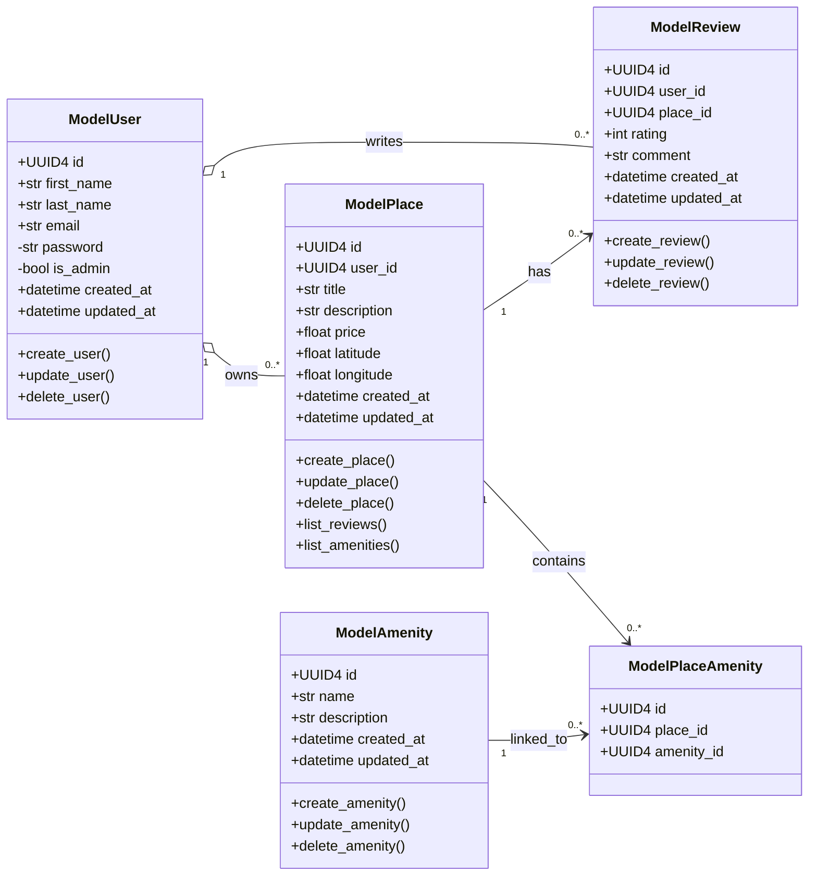
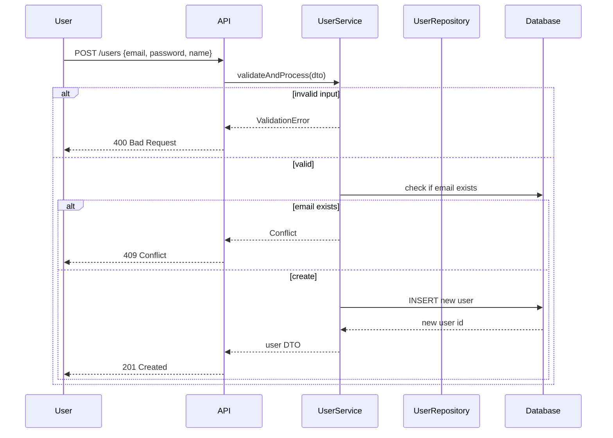
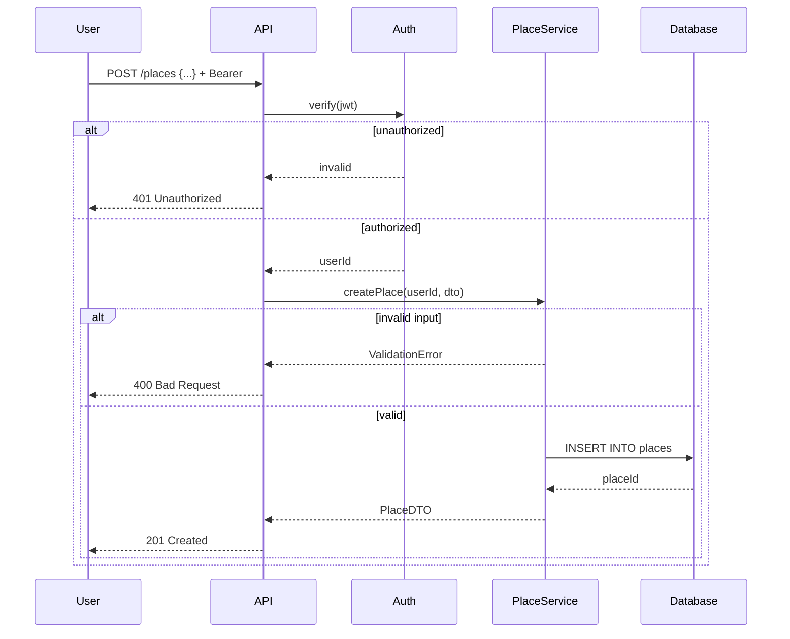
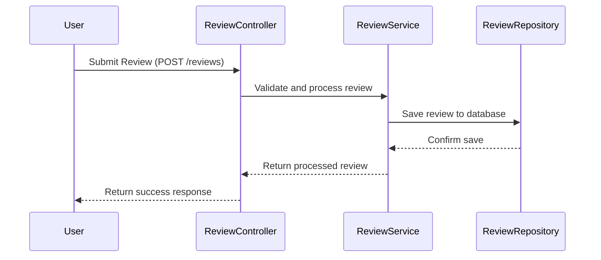
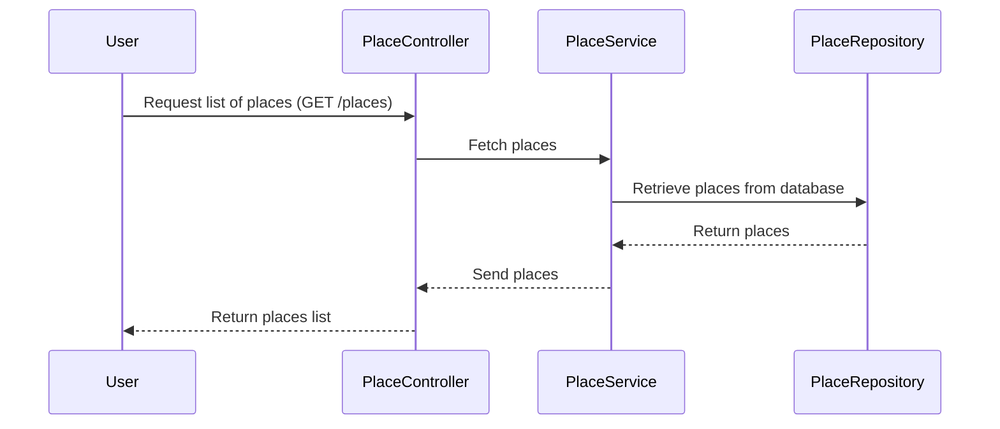

# HBnB - UML Design Documentation

---

## Table of Contents
- [Project Overview](#project-overview)
- [Architecture Overview](#architecture-overview)
- [High-Level Package Diagram](#high-level-package-diagram)
- [Business Logic Layer](#business-logic-layer)
- [Entity Relationships](#entity-relationships)
- [Business Rules](#business-rules)
- [Design Decisions](#design-decisions)
- [Sequence Diagrams](#sequence-diagrams-for-api-calls)
- [Authors](#authors)

---

## Project Overview
This project contains comprehensive UML documentation for the HBnB (Holberton Airbnb) application. These diagrams serve as architectural blueprints before development begins and ensure consistency across database design and business logic implementation.

---

## Architecture Overview
The HBnB application follows a layered architecture pattern with clear separation of concerns:

- **Presentation Layer**: User interface and API endpoints  
- **Business Logic Layer**: Core entities and business rules  
- **Data Access Layer**: Database operations and persistence  

---

## High-Level Package Diagram


---

## Business Logic Layer

### Overview

The business logic layer contains the core domain entities that represent the fundamental concepts of our rental platform.

---

### Core Entities

#### User (ModelUser)

Represents platform users who can list properties and write reviews.

* **Key Attributes**: Unique identifier, personal information, authentication data
* **Capabilities**: Create, update, and delete user profiles
* **Security**: Password is private, admin status controls access levels

#### Place (ModelPlace)

Represents properties and their attributes.

* **Key Attributes**: Title, description, location, price, timestamps
* **Relationships**: Owned by a User, can have multiple reviews and amenities

#### Review (ModelReview)

Represents user feedback and ratings for places.

* **Key Attributes**: Rating, comment, timestamps
* **Relationships**: Written by a User for a specific Place

#### Amenity (ModelAmenity)

Represents facilities and services available at places.

* **Key Attributes**: Name, description, management timestamps
* **Relationship**: Many-to-many with Places via ModelPlaceAmenity

#### PlaceAmenity (ModelPlaceAmenity)

Junction table managing the many-to-many relationship between Places and Amenities.

---

### Class Diagram



---

## Entity Relationships

* **User -> Place**: One-to-Many (1:0..*)
* **Place -> Review**: One-to-Many (1:0..*)
* **Place <-> Amenity**: Many-to-Many (via PlaceAmenity)

---

## Business Rules

* Only authenticated users can create places or reviews
* Users cannot review their own properties
* Referential integrity must be maintained for all foreign keys
* Amenities can be shared across multiple places

---

## Design Decisions

* **UUID4** for all primary keys
* Automatic timestamps for creation and update
* Integer coordinates for latitude/longitude
* Integer rating scale (1–5)
* Future considerations: soft delete, audit trails, rating validation

---

## Sequence Diagrams for API Calls

### User Registration



### Place Creation



### Review Submission



### Fetching a List of Places



---

## Authors

Omar, Warren, Wassef

```

