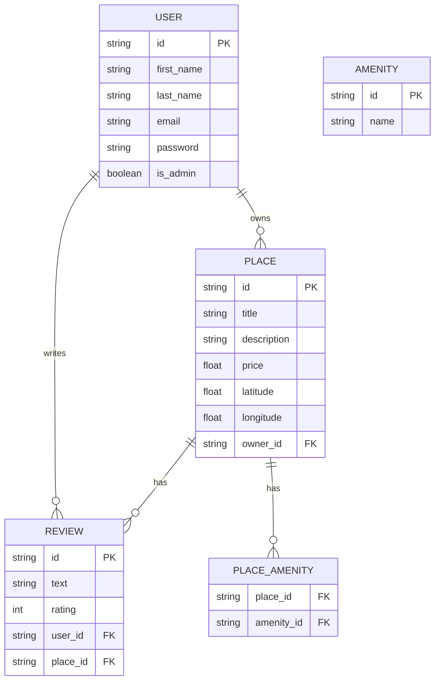

# HBnB — Diagramme database

Ce fichier contient le diagramme représentant le schéma de base de données principal du projet HBnB : User, Place, Review, Amenity et la table de jointure Place_Amenity.

